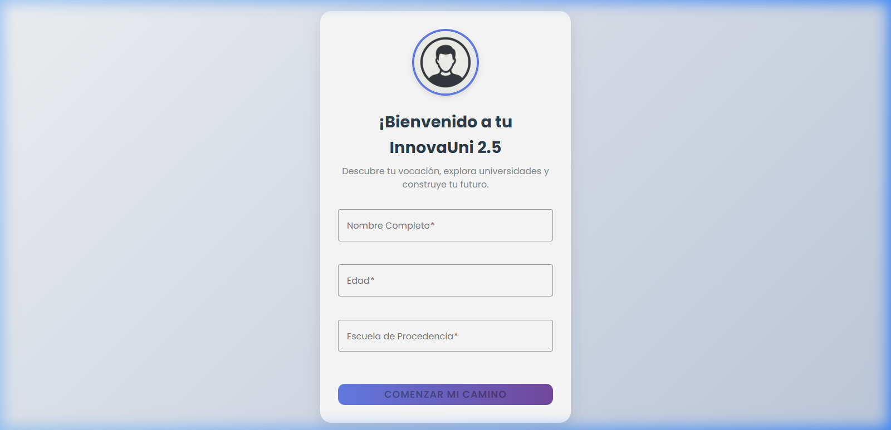
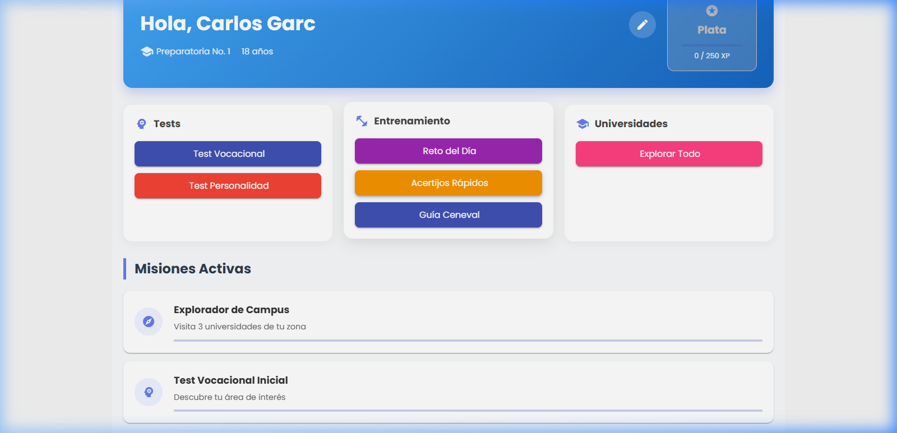
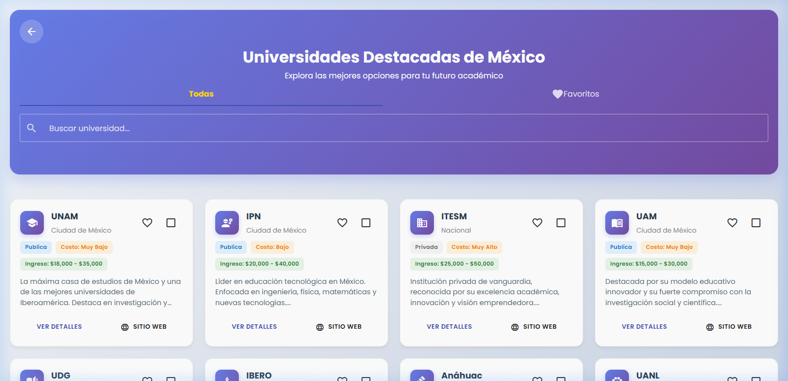
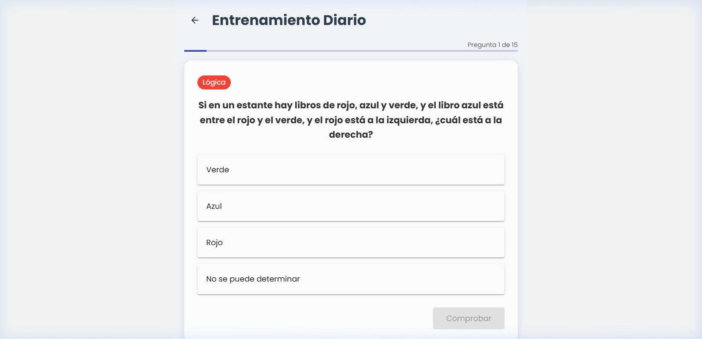
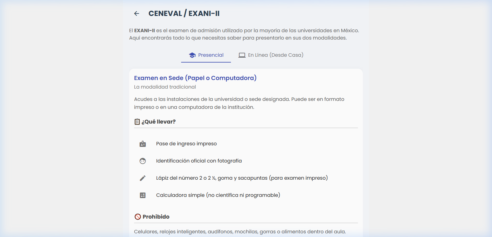

<p align="center">
  
</p>

<h1 align="center">🎓 InnovaUni 2.5</h1>

<p align="center">
  <strong>Tu guía universitaria gamificada para descubrir tu vocación y explorar el futuro académico</strong>
</p>

<p align="center">
  
  
  
  
  
</p>

---

## 📋 Tabla de Contenidos

- [¿Qué es InnovaUni?](#-qué-es-innovauni)
- [Capturas de Pantalla](#-capturas-de-pantalla)
- [Características Principales](#-características-principales)
- [Arquitectura del Proyecto](#-arquitectura-del-proyecto)
- [Requisitos Previos](#-requisitos-previos)
- [Instalación y Configuración](#-instalación-y-configuración)
- [Guía de Uso — Manual del Usuario](#-guía-de-uso--manual-del-usuario)
  - [1. Onboarding — Primer Inicio](#1-onboarding--primer-inicio)
  - [2. Dashboard — Panel Principal](#2-dashboard--panel-principal)
  - [3. Tests Vocacionales y de Personalidad](#3-tests-vocacionales-y-de-personalidad)
  - [4. Explorador de Universidades](#4-explorador-de-universidades)
  - [5. Entrenamiento Diario](#5-entrenamiento-diario)
  - [6. Guía CENEVAL / EXANI-II](#6-guía-ceneval--exani-ii)
  - [7. Sistema de Gamificación](#7-sistema-de-gamificación)
- [Stack Tecnológico](#-stack-tecnológico)
- [Estructura de Carpetas](#-estructura-de-carpetas)
- [Compilación para Producción](#-compilación-para-producción)
- [Generación de APK (Android)](#-generación-de-apk-android)
- [Contribución](#-contribución)
- [Licencia](#-licencia)

---

## 🎯 ¿Qué es InnovaUni?

**InnovaUni 2.5** es una aplicación web/móvil diseñada para **estudiantes de preparatoria y bachillerato en México** que están en proceso de elegir su carrera universitaria. La app combina orientación vocacional con una experiencia gamificada para hacer el proceso de exploración universitaria más interactivo y motivador.

### ¿Para quién es esta app?

| Perfil | Descripción |
|--------|-------------|
| 🧑‍🎓 **Estudiantes de preparatoria** | Que están por elegir carrera y universidad |
| 👨‍👩‍👧 **Padres de familia** | Que desean acompañar a sus hijos en la decisión |
| 🏫 **Orientadores vocacionales** | Que buscan herramientas complementarias para sus alumnos |

### ¿Qué problema resuelve?

Elegir una carrera universitaria puede ser abrumador. InnovaUni simplifica este proceso al ofrecer:

- **Tests vocacionales** basados en el modelo RIASEC (Holland)
- **Explorador interactivo** de universidades mexicanas con datos reales
- **Comparaciones lado a lado** entre instituciones
- **Simulador CENEVAL/EXANI-II** para practicar antes del examen de admisión
- **Gamificación** (niveles, medallas, misiones) que mantiene al estudiante motivado

---

## 📸 Capturas de Pantalla

### Pantalla de Bienvenida (Onboarding)
<p align="center">
  
</p>

> El primer contacto del estudiante con la app. Registra tu nombre, edad y escuela para comenzar tu aventura universitaria.

### Dashboard Principal
<p align="center">
  
</p>

> Tu centro de control. Desde aquí accedes a tests, entrenamientos, explorador de universidades y ves tu progreso con misiones activas y sistema de niveles.

### Explorador de Universidades
<p align="center">
  
</p>

> Navega entre las universidades más importantes de México. Filtra por nombre, tipo (pública/privada), ubícalas y compáralas.

### Entrenamiento Diario
<p align="center">
  
</p>

> Practica con preguntas de lógica, matemáticas y comprensión lectora. Gana EXP y mejora tu preparación para el examen de admisión.

### Guía CENEVAL / EXANI-II
<p align="center">
  
</p>

> Todo lo que necesitas saber sobre el examen de admisión universitaria: modalidad presencial, en línea, qué llevar, qué evitar y la estructura del examen.

---

## ✨ Características Principales

### 🧠 Tests Vocacionales
| Característica | Descripción |
|---|---|
| **Test Vocacional (RIASEC)** | Basado en la teoría de Holland, identifica tu perfil vocacional entre 6 áreas: Realista, Investigador, Artístico, Social, Emprendedor, Convencional |
| **Test de Personalidad** | Descubre tu tipo de personalidad y cómo se relaciona con distintas carreras |
| **Acertijos Rápidos** | Mini-juegos de lógica que estimulan tu pensamiento crítico |

### 🏛️ Explorador de Universidades
- **12+ universidades mexicanas** con datos detallados (UNAM, IPN, ITESM, UAM, UDG, IBERO, Anáhuac, UANL, TecNM, UAEH, UFD, UVM)
- **Radar de estadísticas** con 5 ejes: Prestigio, Empleabilidad, Salario, Accesibilidad, Calidad de Vida
- **Sistema de favoritos** para guardar tus universidades preferidas
- **Comparador** hasta 3 universidades lado a lado
- **Buscador** por nombre, siglas, ubicación o área de conocimiento
- **Links directos** al sitio web, planes de estudio y convocatorias

### 🏋️ Entrenamiento y Preparación
- **Reto del Día**: 15 preguntas aleatorias de matemáticas, lectura y lógica
- **Guía CENEVAL/EXANI-II**: Información completa sobre el examen de admisión
- **Modalidades**: Presencial y en línea con requisitos específicos
- **Estructura del examen**: Comprensión Lectora, Redacción, Pensamiento Matemático, Módulos Específicos e Inglés

### 🎮 Sistema de Gamificación
| Elemento | Descripción |
|---|---|
| **Niveles y XP** | Gana experiencia completando actividades y sube de nivel |
| **Rangos** | Progresa desde Plata hasta los rangos más altos |
| **Medallas y Logros** | Desbloquea logros como "Primer Paso", "Explorador de Campus", "Comparador Experto" |
| **Misiones Activas** | Completa objetivos específicos como visitar universidades o hacer tests |
| **Monedas** | Acumula monedas virtuales como recompensa |
| **Certificado / Compendio** | Al completar todo, genera una imagen compartible con tu historia InnovaUni |

---

## 🏗️ Arquitectura del Proyecto

```
InnovaUni 2.5
├── 🌐 Frontend (Angular 21 + Angular Material)
│   ├── Componentes standalone con lazy loading
│   ├── SCSS con variables CSS globales
│   └── Animaciones con @angular/animations
│
├── 📱 Mobile (Capacitor 8)
│   ├── Android build (APK/AAB)
│   ├── Filesystem API (para exportar imágenes)
│   └── Share API (para compartir contenido)
│
├── 🗄️ Backend (Supabase)
│   ├── Autenticación (email/password)
│   ├── Base de datos PostgreSQL
│   └── Row Level Security (RLS)
│
└── 📦 Servicios Core
    ├── GamificationService — Motor de gamificación
    ├── TrainingService — Banco de preguntas (700+)
    ├── AuthService — Autenticación con Supabase
    └── StorageService — Persistencia local
```

---

## 📦 Requisitos Previos

Antes de comenzar, asegúrate de tener instalado:

| Herramienta | Versión Mínima | Propósito |
|---|---|---|
| **Node.js** | 18.x o superior | Entorno de ejecución |
| **npm** | 9.x o superior | Gestor de paquetes |
| **Angular CLI** | 21.x | Framework frontend |
| **Git** | Cualquiera | Control de versiones |
| **Android Studio** | (Opcional) | Para compilar la APK |

---

## 🚀 Instalación y Configuración

### 1. Clonar el repositorio

```bash
git clone https://github.com/ulises12pg/guia-universitaria.git
cd guia-universitaria
```

### 2. Instalar dependencias

```bash
npm install
```

### 3. Configurar Supabase (Opcional)

Si deseas habilitar la autenticación y persistencia en la nube:

1. Crea un proyecto en [supabase.com](https://supabase.com)
2. Ejecuta el script `supabase_schema.sql` en el editor SQL de Supabase
3. Copia tu `SUPABASE_URL` y `SUPABASE_ANON_KEY`
4. Configura las variables en el servicio de autenticación (`src/app/core/services/auth.service.ts`)

### 4. Iniciar el servidor de desarrollo

```bash
ng serve
```

Abre tu navegador en [http://localhost:4200](http://localhost:4200) 🎉

> **Nota:** La aplicación recarga automáticamente al guardar cambios en el código fuente.

---

## 📖 Guía de Uso — Manual del Usuario

### 1. Onboarding — Primer Inicio

Al abrir la app por primera vez, verás la **pantalla de bienvenida**:

1. **Ingresa tu nombre completo** — Será utilizado para personalizar tu experiencia
2. **Ingresa tu edad** — Ayuda a contextualizar las recomendaciones
3. **Ingresa tu escuela de procedencia** — Se mostrará en tu perfil
4. Presiona **"COMENZAR MI CAMINO"** para acceder al dashboard

> 💡 **Tip:** Al completar el onboarding, desbloquearás automáticamente el logro **"Primer Paso"** y ganarás tu primera experiencia.

---

### 2. Dashboard — Panel Principal

El Dashboard es tu **centro de comando**. Aquí encontrarás:

#### Sección Superior — Tu Perfil
- **Nombre y datos**: Tu nombre, escuela y edad
- **Rango actual**: Tu nivel de progreso (ej. Plata, Oro)
- **Barra de XP**: Muestra tu progreso hacia el siguiente nivel
- **Botón de editar** (✏️): Modifica tu perfil en cualquier momento

#### Acciones Rápidas
Organizadas en 3 grupos:

| Grupo | Botones | Función |
|---|---|---|
| **🧠 Tests** | Test Vocacional, Test Personalidad | Descubre tu perfil vocacional |
| **🏋️ Entrenamiento** | Reto del Día, Acertijos Rápidos, Guía Ceneval | Practica para el examen |
| **🏫 Universidades** | Explorar Todo | Navega el catálogo completo |

#### Misiones Activas
- Cada misión tiene un **título**, **descripción** y **barra de progreso**
- Haz clic en una misión para ir directamente a la actividad relacionada
- Al completar misiones ganas **EXP** y **monedas**

#### Logros y Medallas
- Las medallas completadas aparecen a **color**
- Las pendientes se muestran en **escala de grises**
- Haz clic en cualquier medalla para ver su **descripción completa**

#### 🏆 Salón de la Fama
- Al desbloquear **todas** las medallas, aparece el botón **"VER LOGROS"**
- Genera un **compendio visual** (tarjeta) con tu historial completo
- Puedes **compartirlo como imagen** en redes sociales

#### ⚠️ Zona de Peligro
- **Resetear Progreso**: Reinicia EXP y logros, pero conserva tu perfil
- **Hard Reset**: Elimina **toda** la información permanentemente

---

### 3. Tests Vocacionales y de Personalidad

#### Test Vocacional (Modelo RIASEC)
1. Desde el Dashboard, presiona **"Test Vocacional"**
2. Responde una serie de preguntas sobre tus intereses y habilidades
3. Cada pregunta evalúa tu afinidad con las 6 áreas de Holland:
   - 🔧 **Realista** — Trabajo práctico, mecánico, al aire libre
   - 🔬 **Investigador** — Ciencia, análisis, resolución de problemas
   - 🎨 **Artístico** — Creatividad, expresión, diseño
   - 🤝 **Social** — Ayudar, enseñar, cuidar
   - 💼 **Emprendedor** — Liderazgo, ventas, persuasión
   - 📊 **Convencional** — Organización, datos, administración
4. Al finalizar, recibirás tu **perfil vocacional** con el área dominante
5. La app te sugerirá universidades y carreras afines a tu perfil

#### Test de Personalidad
1. Presiona **"Test Personalidad"** desde el Dashboard
2. Responde preguntas sobre tu comportamiento y preferencias
3. Obtén tu tipo de personalidad
4. Descubre cómo tu personalidad se relaciona con diferentes carreras

#### Acertijos Rápidos
1. Presiona **"Acertijos Rápidos"** desde el Dashboard
2. Resuelve mini-desafíos de lógica y razonamiento
3. Gana EXP por cada acertijo resuelto correctamente

---

### 4. Explorador de Universidades

#### Navegación Principal
1. Desde el Dashboard, presiona **"Explorar Todo"**
2. Verás un catálogo con **12+ universidades** mexicanas

#### Funciones del Explorador

| Función | Cómo usarla |
|---|---|
| **Buscar** | Escribe en la barra de búsqueda (por nombre, siglas, ubicación o área) |
| **Filtrar por favoritos** | Cambia a la pestaña **"Favoritos"** |
| **Agregar a favoritos** | Presiona el ícono ❤️ en la tarjeta de universidad |
| **Ver detalles** | Presiona **"VER DETALLES"** en cualquier tarjeta |
| **Visitar sitio web** | Presiona **"SITIO WEB"** para abrir el portal oficial |
| **Comparar** | Selecciona hasta 3 universidades con el ícono 📋 e inicia la comparación |

#### Vista de Detalles
Al abrir los detalles de una universidad verás:
- **Información general**: Tipo, costo, salario promedio de egresados, empleabilidad
- **Radar de estadísticas**: Gráfica pentagonal con 5 métricas
- **Áreas de conocimiento**: Chips con las áreas de especialidad
- **Acciones**: Buscar plan de estudios, ver convocatoria, explorar carreras por área

#### Comparador
1. Selecciona **2 o 3 universidades** presionando el ícono de comparación
2. Presiona **"Comparar"** para ver una tabla comparativa
3. Compara: prestigio, empleabilidad, salario, accesibilidad y calidad de vida
4. Elimina universidades de la comparación individualmente

---

### 5. Entrenamiento Diario

1. Desde el Dashboard, presiona **"Reto del Día"**
2. Se generan **15 preguntas aleatorias** de tres materias:
   - 📐 **Matemáticas** — Álgebra, aritmética, geometría
   - 📖 **Lectura** — Comprensión lectora y análisis de textos
   - 🧩 **Lógica** — Razonamiento lógico y resolución de problemas
3. Para cada pregunta:
   - Lee el enunciado y selecciona tu respuesta
   - Presiona **"Comprobar"** para verificar
   - Verás si acertaste (✅ verde) o fallaste (❌ rojo) con la respuesta correcta
   - Presiona **"Siguiente"** para continuar
4. Al finalizar las 15 preguntas, verás:
   - Tu **puntaje** (aciertos / total)
   - Un **mensaje de feedback** personalizado
   - La **EXP ganada** (100 base + 20 por acierto)

---

### 6. Guía CENEVAL / EXANI-II

1. Desde el Dashboard, presiona **"Guía Ceneval"**
2. Consulta información sobre las dos modalidades del examen:

#### Modalidad Presencial
- ✅ Qué llevar: Pase de ingreso, INE, lápiz #2, calculadora simple
- ❌ Prohibido: Celulares, smartwatch, audífonos, mochilas
- 💡 Tip: Llegar 30 minutos antes

#### Modalidad En Línea (Desde Casa)
- 💻 Requisitos: PC o laptop, cámara, micrófono, internet estable
- 🏠 Ambiente: Solo en habitación iluminada, escritorio limpio
- ⚠️ Cuidado: No desviar la vista, no hablar, no levantarse

#### Estructura del Examen
| Módulo | Preguntas |
|---|---|
| Comprensión Lectora | 30 |
| Redacción Indirecta | 30 |
| Pensamiento Matemático | 30 |
| Módulos Específicos | 48 (varían por carrera) |
| Inglés | Diagnóstico (no cuenta) |

3. Presiona **"IR AL SIMULADOR"** para practicar directamente

---

### 7. Sistema de Gamificación

InnovaUni utiliza elementos de gamificación para mantenerte motivado:

```
┌─────────────────────────────────────────────────┐
│  📊 Progresión                                  │
│                                                 │
│  Actividad → EXP → Subir de Nivel → Rango      │
│      ↓                                          │
│  Misiones → Objetivos → Recompensas             │
│      ↓                                          │
│  Logros → Medallas → Salón de la Fama           │
│      ↓                                          │
│  Compendio → Compartir 🎉                       │
└─────────────────────────────────────────────────┘
```

#### Cómo ganar EXP

| Actividad | EXP Aproximada |
|---|---|
| Completar onboarding | Variable |
| Hacer Test Vocacional | Variable |
| Hacer Test de Personalidad | Variable |
| Visitar una universidad | Variable |
| Completar entrenamiento diario | 100 + (20 × aciertos) |
| Completar misiones | Según tipo de misión |
| Resolver acertijos | Variable |

---

## 🛠️ Stack Tecnológico

| Tecnología | Uso |
|---|---|
| **Angular 21** | Framework frontend con componentes standalone |
| **Angular Material** | Librería de UI (Material Design) |
| **Capacitor 8** | Empaquetado nativo para Android |
| **Supabase** | Backend as a Service (Auth + DB) |
| **SCSS** | Estilos con variables CSS personalizadas |
| **jsPDF** | Generación de certificados PDF |
| **html2canvas** | Captura de pantalla para compartir |
| **ngx-toastr** | Notificaciones tipo toast |
| **Vitest** | Framework de testing |
| **TypeScript 5.9** | Lenguaje tipado |

---

## 📁 Estructura de Carpetas

```
guia-universitaria/
├── 📂 src/
│   ├── 📂 app/
│   │   ├── 📂 core/                   # Servicios centrales y guards
│   │   │   ├── 📂 guards/             # Route guards
│   │   │   └── 📂 services/           # Servicios del core
│   │   │       ├── auth.service.ts        # Autenticación Supabase
│   │   │       ├── gamification.service.ts # Motor de gamificación
│   │   │       ├── training.service.ts     # Banco de 700+ preguntas
│   │   │       ├── storage.service.ts      # Persistencia local
│   │   │       └── university.service.ts   # Datos de universidades
│   │   │
│   │   ├── 📂 features/               # Módulos de funcionalidad
│   │   │   ├── 📂 auth/                  # Login / Registro
│   │   │   ├── 📂 dashboard/             # Panel principal
│   │   │   ├── 📂 exams/                 # Guía CENEVAL
│   │   │   ├── 📂 onboarding/            # Bienvenida inicial
│   │   │   ├── 📂 profile/               # Perfil del usuario
│   │   │   ├── 📂 quests/                # Tests y acertijos
│   │   │   │   ├── 📂 vocational-test/       # Test vocacional RIASEC
│   │   │   │   ├── 📂 personality-test/      # Test de personalidad
│   │   │   │   └── 📂 quick-riddles/         # Acertijos rápidos
│   │   │   ├── 📂 training/              # Entrenamiento diario
│   │   │   └── 📂 universities/          # Explorador de universidades
│   │   │
│   │   ├── 📂 shared/                 # Código compartido
│   │   │   ├── 📂 components/            # Componentes reutilizables
│   │   │   │   ├── badge/                    # Insignias
│   │   │   │   ├── confetti/                 # Efecto de confeti
│   │   │   │   ├── legal-modal/              # Modal legal
│   │   │   │   └── progress-bar/             # Barra de progreso
│   │   │   └── 📂 models/               # Interfaces TypeScript
│   │   │       ├── user.model.ts             # Modelo de usuario
│   │   │       ├── university.model.ts       # Modelo de universidad
│   │   │       ├── quest.model.ts            # Modelo de misión
│   │   │       └── achievement.model.ts      # Modelo de logro
│   │   │
│   │   ├── 📂 services/               # Servicios a nivel app
│   │   ├── app.routes.ts              # Definición de rutas
│   │   ├── app.config.ts              # Configuración de la app
│   │   └── app.ts                     # Componente raíz
│   │
│   ├── 📂 assets/                     # Recursos estáticos
│   │   └── 📂 avatars/               # Imágenes de avatares
│   ├── index.html                     # HTML principal
│   ├── main.ts                        # Punto de entrada
│   └── styles.scss                    # Estilos globales
│
├── 📂 android/                        # Proyecto nativo Android
├── 📂 docs/screenshots/               # Capturas de pantalla (README)
├── 📂 icons/                          # Iconos de la app (WebP)
├── 📂 public/                         # Archivos públicos
│   ├── favicon.png                    # Ícono del navegador
│   └── manifest.webmanifest           # PWA manifest
│
├── angular.json                       # Configuración Angular
├── capacitor.config.ts                # Configuración Capacitor
├── package.json                       # Dependencias npm
├── supabase_schema.sql                # Esquema de base de datos
└── tsconfig.json                      # Configuración TypeScript
```

---

## 🏗️ Compilación para Producción

```bash
# Compilar la aplicación optimizada
ng build

# Los archivos se generan en dist/innova-uni/browser/
```

La compilación de producción incluye:
- ✅ Minificación de código
- ✅ Tree-shaking (eliminación de código no utilizado)
- ✅ Hashing de archivos para cache-busting
- ✅ Lazy loading automático por ruta

---

## 📱 Generación de APK (Android)

### Requisitos adicionales
- Android Studio instalado
- JDK 17 o superior

### Pasos

```bash
# 1. Compilar la app web
ng build

# 2. Sincronizar con el proyecto Android
npx cap sync android

# 3. Abrir en Android Studio
npx cap open android
```

En Android Studio:
1. Ve a **Build → Generate Signed Bundle/APK**
2. Selecciona **APK**
3. Usa el keystore configurado en `capacitor.config.ts`
4. Genera la APK firmada

---

## 🧪 Testing

```bash
# Ejecutar tests unitarios con Vitest
ng test
```

---

## 🤝 Contribución

¡Las contribuciones son bienvenidas! Para contribuir:

1. **Fork** este repositorio
2. Crea una **rama** para tu feature: `git checkout -b feature/mi-nueva-funcionalidad`
3. **Commit** tus cambios: `git commit -m 'Agrega mi nueva funcionalidad'`
4. **Push** a la rama: `git push origin feature/mi-nueva-funcionalidad`
5. Abre un **Pull Request**

### Convenciones de código
- Componentes **standalone** (no módulos)
- Estilos en **SCSS** con variables CSS del design system
- Nombres de archivos en **inglés**, UI y contenido en **español**
- Uso de **Angular Material** para componentes de UI

---

## 📄 Licencia

Este proyecto es propiedad de **InnovaUni 2026**. Todos los derechos reservados.

---

<p align="center">
  <strong>Hecho con ❤️ para los estudiantes de México</strong>
</p>

<p align="center">
  <sub>InnovaUni 2.5 — Descubre tu vocación, explora universidades y construye tu futuro 🎓</sub>
</p>
